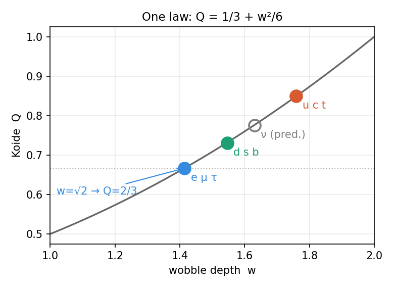
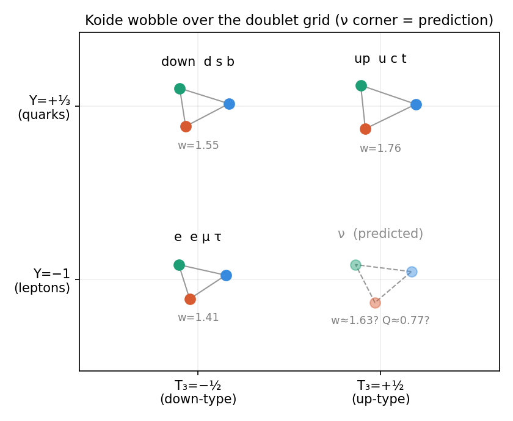

# Koide's 2/3 as a Generation-Coherence Structure: an Event Density Re-description, a Toy Doublet-Grid Map, and a Neutrino Prediction

**Series:** Event Density (ED) Generative Papers — substrate-evaluation / mass arc.

**Status:** RE-DESCRIPTION + explicit TOY-MODEL exploration. This paper does **not** derive any mass, coupling, or the Koide value; it restates a known empirical relation in ED's amplitude/coherence language and records one falsifiable-in-principle toy prediction (since checked against neutrino oscillation data and disfavored — §4). Tiers are flagged per claim.

**Companions:** `Paper_113_ArcM_H1_MassStructuralForm` (mass = rest-frame bandwidth content), `Paper_MassWithoutMass_BindingInertia` and `Note_MassArc_BindingMassScale_Scoping` (the binding-mass mechanism and its inherited scale), `Paper_ChargeAsTopology_B4` (charge as integer winding; the retrofit-avoidance discipline this paper obeys).

**Author:** Allen Proxmire · **Date:** August 2026

---

## Preamble — what this paper does NOT claim *(written first, per QC discipline)*

1. **It does not derive the lepton masses, any quark mass, or the neutrino masses.** All masses here are inherited from experiment.
2. **It does not derive Koide's value 2/3.** ED cannot: the masses live in the Standard Model flavor sector, which ED inherits, and ED does not even ground *why there are three generations* (that count is marked refuted-as-forced in the corpus).
3. **The "charge-cone" and "doublet-grid" constructions of §4 are TOY MODELS** — organizing pictures fitted to at most three real data points per axis, offered to sharpen the question, not as laws. Their only testable content is one prediction (the neutrino corner) — which the measured neutrino mass-squared splittings already disfavor (§4): the toy fails there, while the rigid charged-lepton 2/3 stands.
4. **No fraction is retrofitted onto ED.** Per `Paper_ChargeAsTopology_B4`'s standing rule, we do not tune any ED structure to hit 2/3, √2, or 2/9. The ED content is a *re-description* of a known relation, explicitly tiered as such.
5. **The one genuine ED claim is a shape-match**, not a mechanism: Koide's algebraic form is the amplitude-vs-probability structure ED is built on. That is consilience-tier at most.

---

## Abstract

The Koide relation — that the three charged-lepton masses satisfy $Q = (m_e+m_\mu+m_\tau)/(\sqrt{m_e}+\sqrt{m_\mu}+\sqrt{m_\tau})^2 = 2/3$ to one part in 10⁵ — is a genuine, complete-data regularity (there are exactly three generations; none is omitted). We record three things. First, a compact restatement: writing each fermion family in Brannen form places the three generations 120° apart on a circle, and the entire Koide phenomenology reduces to the one line **Q = 1/3 + w²/6**, where the "wobble depth" w is √2 for the charged leptons (the value that yields 2/3) and larger for the quark families. Second, an Event Density re-description: since mass is rest-frame bandwidth content (`Paper_113`) and ED's carrier is $P = \sqrt{b}\,e^{i\pi_K}$ (with π_K the polarity phase), the √m in Koide's formula plays the role of the ED amplitude of a mass-mode — treating the three generations as coherent amplitude-channels, an organizing choice rather than a corpus result — so Q reads as a coherence ratio among three generation-amplitudes. This is a shape-match, not a derivation. Third, two toy maps that place the wobble over the fermions' real quantum numbers (electric charge; then weak isospin × hypercharge); both are underdetermined by the three charged data points, and both extrapolate to the same single prediction — a neutrino Koide value **Q ≈ 0.77** — which the measured neutrino mass-squared splittings already disfavor: every physically allowed value is bounded at Q_ν ≤ 0.59 (normal ordering), so the wobble shrinks toward the neutral corner rather than growing to it. The rigid charged-lepton 2/3 is untouched. We are explicit throughout that ED re-describes and toy-maps this structure; it does not derive it.

## 1. The relation, and the honest weight it carries

Koide (1981) observed that the three charged-lepton pole masses satisfy

$$Q = \frac{m_e+m_\mu+m_\tau}{(\sqrt{m_e}+\sqrt{m_\mu}+\sqrt{m_\tau})^2} = 0.666659 \approx \tfrac{2}{3},$$

precise to ~1 part in 10⁵, and *tightening* toward 2/3 as the τ mass has been remeasured over four decades. Two honest points frame everything below.

**This is a complete-data regularity, not a small sample.** There are exactly three charged-lepton generations; no fourth exists to measure, and none was left out. So Koide is the *entire* dataset producing one dimensionless number that lands on a simple fraction. That is why it is taken seriously and is not dismissible as a coincidence among many trials — there are no other trials.

**It is clean only for the charged leptons.** The up- and down-quark families give Q ≈ 0.85 and 0.73, but quark masses are scheme-dependent (running values), so those numbers are soft. Neutrino masses are essentially unknown. The rigid, remarkable fact is the charged-lepton 2/3.

## 2. The geometry, and one law behind every family

Write each family in the **Brannen (2005) form**:

$$\sqrt{m_k} = M\,\big(1 + w\cos(\delta + \tfrac{2\pi k}{3})\big), \qquad k = 0,1,2,$$

three points **120° apart on a circle** (a Z₃ / democratic arrangement) with overall scale M, wobble depth w, and phase offset δ. Each dot's horizontal projection is a √m (Figure 1). Because the three cosines sum to zero and their squares sum to 3/2, one gets Σ√m = 3M and Σm = M²(3 + 3w²/2), so the whole Koide quantity collapses to

$$\boxed{\,Q = \tfrac{1}{3} + \tfrac{w^2}{6}\,}.$$

{width=66%}

So **Q depends only on the wobble depth w**, not on δ or M. The families differ only in w: charged leptons at **w = √2** (⇒ Q = 2/3 exactly — the √m vector at 45° to the (1,1,1) diagonal, cos = 1/√2), down-quarks at w ≈ 1.55, up-quarks at w ≈ 1.76 (Figure 2). The phase δ rotates the triangle and sets the *ratios* among the three masses (leptons: 1 : 207 : 3477, the real values) without touching Q. For the leptons δ ≈ 0.222 ≈ 2/9 rad — a second, separate, unexplained near-coincidence, and **not** the source of the 2/3 (which holds for any δ). A structural aside, since it is the first question the cone invites: because M cancels from Q, Koide fixes only the triangle's *shape*, never its size. The scale is inherited, not predicted — M² ≈ 314 MeV, near the QCD/constituent-quark scale and some twenty orders of magnitude below the Planck mass. The relation points at no fundamental scale, and the cone's apex is the massless origin, not a deep constant.

{width=66%}

## 3. The Event Density re-description (a shape-match, not a derivation)

Koide's skeleton is (Σ m)/(Σ √m)² = (sum of squared amplitudes)/(coherent sum, squared). That is the **amplitude-vs-probability structure of quantum mechanics**: add amplitudes and square to get interference; sum the squares to get probabilities. Event Density is built on exactly this object. Its participation carrier is $P = \sqrt{b}\,e^{i\pi_K}$ (π_K the polarity phase), its Born rule reads $f = |P|^2$ (`Paper_003`), and mass is **rest-frame bandwidth content b** (`Paper_113`, tier M2). Hence **√m maps onto the ED amplitude of a mass-carrying mode** — if the three generations are read as coherent amplitude-channels, an organizing assumption rather than a corpus result — and Koide's Q is then a **coherence / spread ratio among the three generation-amplitudes** — how democratically the three lepton modes share amplitude — with 2/3 a balanced value. Brannen's form then reads directly in ED terms: three amplitudes at 120° relative phase (Z₃), wobble depth √2, offset δ ≈ 2/9.

**Tier.** This is RE-DESCRIPTION. It re-expresses the *shape* of Koide (the roots, the square, the 1/3-to-1 range) in ED's own idiom, and nothing more; the Z₃ three-generation structure is an inherited *input* (Brannen's ansatz fitted to the three known generations), not something ED explains. It does not derive the masses, the generation count, w = √2, or δ ≈ 2/9. Its value is that it relocates the mystery into ED's native variables (amplitude, phase, coherence), which is where any future derivation would have to live — and coherence is the object ED's Σ functional and V5 budget already deal in.

## 4. Two toy maps over the real quantum numbers, and one prediction

Mass is not fundamental in the Standard Model; charge and weak isospin/hypercharge are, with mass downstream. So we ask whether the wobble w organizes over the *real* quantum numbers.

**Charge (1-D).** Against electric charge, the three charged families give (−1, 1.414), (−1/3, 1.546), (+2/3, 1.759): per unit charge the successive slopes are +0.20 and +0.21 — nearly equal, so **w is approximately linear in charge, w ≈ 1.61 + 0.20·Q_charge.** Put charge on a vertical axis and the wobble grows linearly with height — a straight-sided cone (Figure 3).

![Charge as the up-axis. Because the wobble grows about linearly with electric charge, the four sectors stack into a straight-sided cone: leptons at charge −1 (bottom), up-quarks at +2/3 (top), each solid ring carrying its three generations. The dashed ring is the extrapolated neutrino corner at charge 0 (w ≈ 1.63, Q ≈ 0.77) — a prediction the measured neutrino splittings disfavor (Q_ν ≤ 0.59; see §4), i.e. the cone does not in fact keep widening to charge 0. This is the 1-D toy map; it fits three charged points and extrapolates the fourth.](koide_fig4_cone.png){width=62%}

**Isospin × hypercharge (2-D).** More honestly, the fermions live on a 2×2 doublet grid: weak isospin T₃ = ±½ across (up-member vs down-member), hypercharge Y up (quark doublet +⅓, lepton doublet −1). Placing a Koide triangle at each site (Figure 4), the wobble is **monotone in both directions** — up-members exceed down-members, quarks exceed leptons — and lies close to a plane over the grid, largest at the up-quark corner, smallest (√2) at the electron.

{width=80%}

**The one prediction — and why the data already disfavor it.** The plane through the three charged corners puts the neutrinos (T₃ = +½, Y = −1) at **w ≈ 1.63, Koide Q ≈ 0.77** — the dashed ring of Figure 3, the dashed corner of Figure 4, and the open point of Figure 2. The 1-D charge line gives the same value. This is testable *now*, and it fails. Absolute neutrino masses are unknown, but the measured mass-squared splittings alone bound Q_ν regardless of the unknown lightest mass: **Q_ν ≤ 0.586** for normal ordering (largest when the lightest state is massless, falling toward 1/3 as the three masses degenerate) and **Q_ν ≤ 0.500** for inverted ordering. Brannen's own predicted neutrino masses give Q_ν ≈ 0.52. Every physically allowed value sits below the toy's 0.77 — and below the charged-lepton 2/3 as well — so the wobble does **not** grow toward the neutral corner as the cone assumes; it *shrinks*, back toward the democratic 1/3. The charge-linear / planar map is therefore wrong at charge 0. This falsifies the §4 toy extrapolation only; it leaves the rigid charged-lepton 2/3 (§1–2), and everything about ED, untouched — since ED derives none of it.

**Tier — read this before believing the maps.** These are TOY MODELS with soft legs. The lepton 2/3 (§1–2) is rigid and complete-data; the cross-family maps are not. The plane has three free parameters and there are exactly three charged data points, so it fits *automatically* and carries no residual to test — its only content is the neutrino corner. Two of the three inputs (the quark w's) are scheme-fuzzy. And the Standard Model's structure is not truly 1-D: up and down quarks are isospin partners, so a single clean axis can only be partial. So Figure 4 is a legitimate, non-arbitrary *map* (it uses the SM's own labels, not invented ones) plus one filed prediction — not evidence of a law — and that filed prediction is now disfavored by the neutrino splittings (above), exactly as a soft-legged toy should be allowed to fail.

## 5. What connects to ED, and what does not

- **Compatible, at the level of structure.** ED grounds charge as integer topological winding (`Paper_ChargeAsTopology_B4`) and the SU(2)/doublet gauge structure from channel multiplicity, so the axes of Figure 4 are ED-adjacent, and every slice (a coherent superposition of three √m amplitudes) is ED-native language.
- **Not derived.** ED does not produce the fractional hypercharges, the masses, the generation count, or the values w = √2, δ ≈ 2/9. So the docking port — the map's axes and the reason the wobble takes the values it does — is exactly the part ED has not built.
- **The honest ED talking point (consilience-tier).** In the Standard Model, masses are arbitrary Yukawa dials, so Koide's 2/3 is a fluke among free parameters. In ED, mass *is* bandwidth content and √m its amplitude, so "the lepton masses fold into a clean amplitude-on-a-circle relation" is the *kind* of thing expected if masses are amplitudes and a surprise if they are dials. That is a modest point of consilience for ED's ontology — not a derivation, and not to be inflated.

## 6. Bottom line

Read through Event Density, Koide's relation is a **Z₃-symmetric, √2-deep coherence pattern among three generation-amplitudes**, governed entirely by Q = 1/3 + w²/6, with one unexplained phase (δ ≈ 2/9). Over the fermions' real quantum numbers the wobble lays out as a smooth field — a legitimate map, whose single filed prediction (neutrino Q ≈ 0.77) the measured neutrino splittings already disfavor (Q_ν ≤ 0.59), so the map fails at the neutral corner. ED can say this much: it re-describes the structure in its own amplitude/coherence language and offers an honest toy map. It cannot derive the value, the generation count, or any mass — those are the Standard Model flavor sector, which ED inherits. The one thing worth remembering is the **complete-data weight of the lepton 2/3**, which becomes a target for derivation only when ED's gauge-and-generation sector is derived rather than inherited; the toy map's neutrino corner has been tested and did not survive.

## 7. Conclusion — a clue's importance is not its category

Physics ranks its results by category: a theorem outranks a derivation, a derivation outranks a prediction, and near the bottom sits the *unexplained empirical relation* — a number that fits, with no mechanism behind it. Koide's 2/3, and the Brannen parametrization that renders it, have lived in that bottom category for four decades: admired, cited, and quietly shelved as math without a context, one notch above numerology because no one can say why they hold.

That filing understates them, and the reason is worth being precise about. "Unexplained coincidence" is the correct home for a relation that survives on a few noisy points and drifts as the data sharpen — the fate of Dirac's Large Number Hypothesis. Koide is the opposite on each axis that matters: it is **complete data** (there are exactly three charged leptons, none omitted), it is **precise** (one part in 10⁵), and it has grown **tighter, not looser**, across forty years of remeasurement. A relation with those three properties is not so easily dismissed as a fluke; it reads more like a structural fact waiting for a context than a coincidence waiting to be explained away. Its importance and its category have come apart.

Supplying the missing context is the only thing this paper claims to do, and its honest size should be plain. Event Density derives none of it — not Koide, not the masses, not the generation count, not the fitted numbers; the mass sector is inherited, and the preamble says so five ways. What ED offers is a *home*: read mass as bandwidth content and √m as an amplitude, and Koide stops being a context-free number and becomes a coherence statement about three generation-amplitudes — a Z₃-symmetric, √2-deep pattern that lays out as a smooth wobble over the fermions' own quantum numbers. (The toy map's extrapolation to the neutrino corner has since been tested against the oscillation splittings and disfavored; the charged-lepton fact it is built on is untouched.) That is not a proof. It is context, where before there was none.

Which is the whole point, and it is easy to miss in both directions. Over-stated, "ED explains Koide" would be false and a crank move. Under-stated, "just another re-description" misses that relocating a precise, complete-data fact from a context-free number to a structure with a candidate home is exactly how coincidences become clues — and, sometimes, how clues eventually become derivations. Koide may or may not turn out to be one of those. But it has been carried below its weight by the category it was filed under, and the modest ambition of this paper is to say: this one is worth a second look, and here is a language in which it might, one day, be earned.
